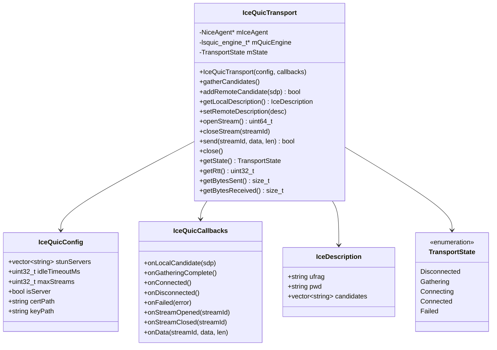
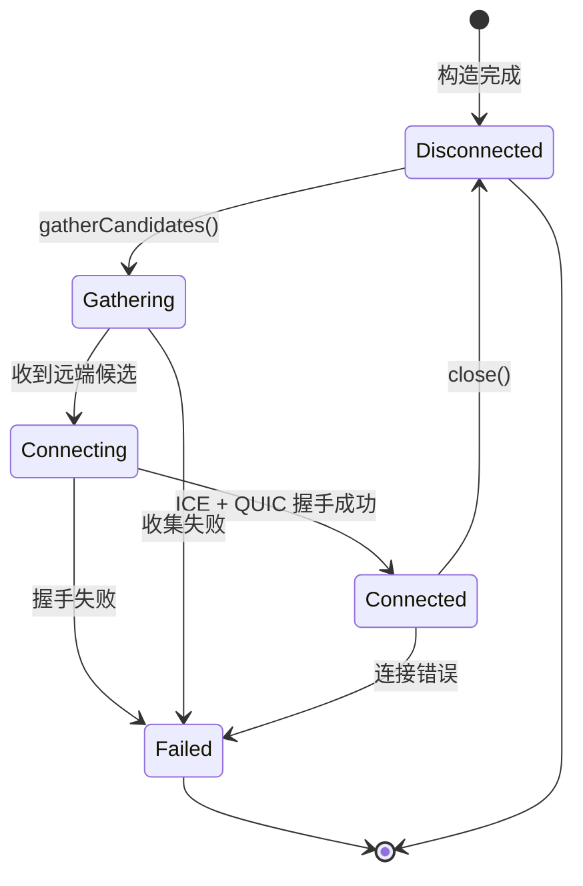

# Design Document: ICE+QUIC P2P Transport Layer Optimization

## Overview

本设计文档描述了对现有 ICE+QUIC P2P 传输层库的优化方案。优化重点是：
1. 充分利用 libnice 的原生 SDP 解析能力
2. 精简 API，专注于 P2P 场景
3. 明确 ICE 层只提供单一 UDP 通道，QUIC 层负责多路复用

### 架构概览

```
┌─────────────────────────────────────────────────────────────┐
│                    Application Layer                         │
└─────────────────────────────────────────────────────────────┘
                              │
                              ▼
┌─────────────────────────────────────────────────────────────┐
│                   IceQuicTransport API                       │
│  - getLocalDescription() / setRemoteDescription()           │
│  - openStream() / closeStream() / send()                    │
│  - gatherCandidates() / addRemoteCandidate()               │
└─────────────────────────────────────────────────────────────┘
                              │
              ┌───────────────┴───────────────┐
              ▼                               ▼
┌─────────────────────────┐     ┌─────────────────────────────┐
│      QUIC Layer         │     │        ICE Layer            │
│       (lsquic)          │     │        (libnice)            │
│  - Stream multiplexing  │     │  - Single component         │
│  - Reliable delivery    │     │  - SDP parsing/generation   │
│  - TLS 1.3 encryption   │     │  - NAT traversal            │
└─────────────────────────┘     └─────────────────────────────┘
              │                               │
              └───────────────┬───────────────┘
                              ▼
┌─────────────────────────────────────────────────────────────┐
│                  Single UDP Channel                          │
│            (ICE 建立的唯一数据通道)                           │
└─────────────────────────────────────────────────────────────┘
```

### 数据流

- **发送**: App → send() → lsquic stream → lsquic packet out → nice_agent_send() → UDP
- **接收**: UDP → libnice recv → lsquic_engine_packet_in() → lsquic stream → onData callback

## Architecture

### 组件架构



### 状态机



## Components and Interfaces

### 1. IceQuicConfig - 简化配置

```cpp
struct IceQuicConfig {
    // STUN 服务器列表
    std::vector<std::string> stunServers = {"stun.l.google.com:19302"};
    
    // QUIC 设置
    uint32_t idleTimeoutMs = 30000;
    uint32_t maxStreams = 100;
    
    // 角色
    bool isServer = false;
    
    // TLS 证书 (服务端)
    std::string certPath;
    std::string keyPath;
};
```

### 2. IceDescription - ICE 描述结构

```cpp
struct IceDescription {
    std::string ufrag;
    std::string pwd;
    std::vector<std::string> candidates;
};
```

### 3. IceQuicCallbacks - 回调接口

```cpp
struct IceQuicCallbacks {
    std::function<void(const std::string& candidateSdp)> onLocalCandidate;
    std::function<void()> onGatheringComplete;
    std::function<void()> onConnected;
    std::function<void()> onDisconnected;
    std::function<void(const std::string& error)> onFailed;
    std::function<void(uint64_t streamId)> onStreamOpened;
    std::function<void(uint64_t streamId)> onStreamClosed;
    std::function<void(uint64_t streamId, const uint8_t* data, size_t len)> onData;
};
```

### 4. IceQuicTransport - 主类 API

```cpp
class IceQuicTransport {
public:
    // 构造/析构
    explicit IceQuicTransport(const IceQuicConfig& config, 
                              const IceQuicCallbacks& callbacks);
    ~IceQuicTransport();
    
    // ICE 操作 - 使用 libnice SDP 解析
    void gatherCandidates();
    bool addRemoteCandidate(const std::string& candidateSdp);
    IceDescription getLocalDescription() const;
    void setRemoteDescription(const IceDescription& desc);
    
    // Stream 操作
    uint64_t openStream();
    void closeStream(uint64_t streamId);
    bool send(uint64_t streamId, const uint8_t* data, size_t len);
    
    // 连接控制
    void close();
    TransportState getState() const;
    
    // 统计
    uint32_t getRtt() const;
    size_t getBytesSent() const;
    size_t getBytesReceived() const;
};
```

## Data Models

### TransportState 枚举

```cpp
enum class TransportState {
    Disconnected = 0,
    Gathering = 1,
    Connecting = 2,
    Connected = 3,
    Failed = 4
};
```

### SDP 候选格式

使用 libnice 原生 SDP 格式：
```
candidate:foundation component protocol priority address port typ type [raddr address] [rport port]
```

示例：
```
candidate:1 1 UDP 2130706431 192.168.1.100 54321 typ host
candidate:2 1 UDP 1694498815 203.0.113.50 54321 typ srflx raddr 192.168.1.100 rport 54321
```

## Correctness Properties

*A property is a characteristic or behavior that should hold true across all valid executions of a system-essentially, a formal statement about what the system should do. Properties serve as the bridge between human-readable specifications and machine-verifiable correctness guarantees.*

### Property 1: Configuration field preservation
*For any* IceQuicConfig with valid field values, after setting each field, reading the field back should return the same value.
**Validates: Requirements 2.2, 2.3, 2.4, 2.5**

### Property 2: SDP candidate round-trip
*For any* valid ICE candidate generated by getLocalDescription, parsing it with addRemoteCandidate on another transport should succeed.
**Validates: Requirements 1.1, 1.2**

### Property 3: Local description completeness
*For any* IceQuicTransport after gathering completes, getLocalDescription should return a structure with non-empty ufrag (4-256 chars), non-empty pwd (22-256 chars), and at least one candidate.
**Validates: Requirements 4.1**

### Property 4: Remote description acceptance
*For any* valid IceDescription with proper ufrag, pwd, and candidates, setRemoteDescription should configure the ICE agent without throwing.
**Validates: Requirements 4.2**

### Property 5: Trickle ICE support
*For any* sequence of valid candidate SDP strings, addRemoteCandidate should accept each one and return true.
**Validates: Requirements 4.3**

### Property 6: Stream ID uniqueness
*For any* sequence of openStream() calls on a connected transport, each returned stream ID should be unique and non-zero.
**Validates: Requirements 5.1**

### Property 7: Data round-trip integrity
*For any* data sent via send() on a connected stream, the onData callback on the peer should receive the exact same bytes.
**Validates: Requirements 5.2, 5.3**

### Property 8: Stream closure
*For any* open stream, after closeStream is called, subsequent send calls on that stream should return false.
**Validates: Requirements 5.4**

### Property 9: State transition validity
*For any* IceQuicTransport, getState should always return a valid TransportState enum value, and state transitions should follow the defined state machine.
**Validates: Requirements 6.1, 6.3, 6.4, 7.4**

### Property 10: Gathering callback guarantee
*For any* IceQuicTransport after gatherCandidates is called, onGatheringComplete callback should eventually be invoked.
**Validates: Requirements 6.2**

### Property 11: Statistics monotonicity
*For any* connected transport, getBytesSent and getBytesReceived should be monotonically non-decreasing, and should increase after successful data transfer.
**Validates: Requirements 7.2, 7.3**

### Property 12: Close callback guarantee
*For any* connected transport, after close() is called, the transport should transition to Disconnected state.
**Validates: Requirements 6.4**

## Error Handling

### 异常类型

```cpp
class IceQuicException : public std::runtime_error {
public:
    enum class ErrorCode {
        InitializationFailed,
        IceError,
        QuicError,
        InvalidState,
        InvalidArgument
    };
    
    IceQuicException(ErrorCode code, const std::string& message);
    ErrorCode code() const;
};
```

### 错误处理策略

1. **构造失败**: 抛出 `IceQuicException`
2. **ICE/QUIC 失败**: 调用 `onFailed` 回调，状态转为 `Failed`
3. **发送失败**: 返回 `false`
4. **无效参数**: 返回 `false` 或抛出异常

## Testing Strategy

### 测试框架

- **单元测试**: Google Test (gtest)
- **属性测试**: RapidCheck

### 属性测试要求

- 每个属性测试运行至少 100 次迭代
- 使用 RapidCheck 生成随机测试数据
- 每个测试标注对应的 Correctness Property

### 测试标注格式

```cpp
// **Feature: ice-quic-transport-optimization, Property 1: Configuration field preservation**
// **Validates: Requirements 2.2, 2.3, 2.4, 2.5**
RC_GTEST_PROP(IceQuicConfigTest, FieldPreservation, ()) {
    // ... property test implementation
}
```

### 单元测试覆盖

1. **配置测试**: 验证 IceQuicConfig 字段
2. **SDP 解析测试**: 验证 libnice SDP 函数使用
3. **状态机测试**: 验证状态转换
4. **回调测试**: 验证回调时机

### 集成测试

1. **本地回环测试**: 同进程 client/server 连接
2. **Echo 测试**: 数据发送和回显验证
3. **多流测试**: 并发 stream 操作

