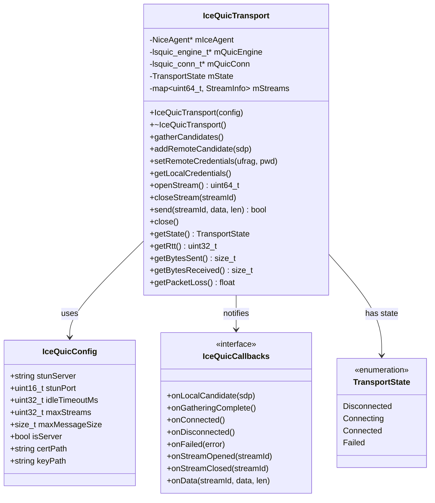
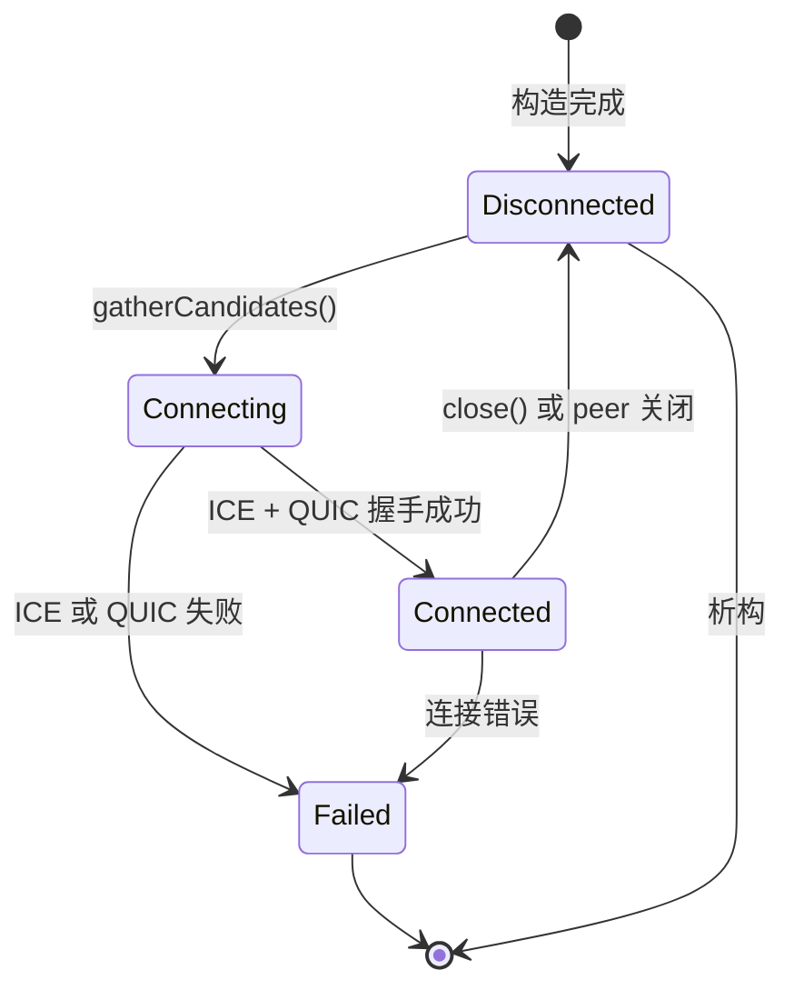

# Design Document: ICE+QUIC P2P Transport Layer

## Overview

本设计文档描述了一个独立的基于 ICE + QUIC 的 P2P 传输层库。该库使用 libnice 进行 NAT 穿透，使用 lsquic 进行 QUIC 协议传输。

### 核心设计思路

```
┌─────────────────────────────────────────────────────────────┐
│                    Application Layer                         │
│                  (User Code / Examples)                      │
└─────────────────────────────────────────────────────────────┘
                              │
                              ▼
┌─────────────────────────────────────────────────────────────┐
│                   IceQuicTransport API                       │
│  - openStream() / closeStream()                              │
│  - send() / onData callback                                  │
│  - gatherCandidates() / addRemoteCandidate()                │
└─────────────────────────────────────────────────────────────┘
                              │
              ┌───────────────┴───────────────┐
              ▼                               ▼
┌─────────────────────────┐     ┌─────────────────────────────┐
│      QUIC Layer         │     │        ICE Layer            │
│       (lsquic)          │     │        (libnice)            │
│  - Stream multiplexing  │     │  - STUN binding             │
│  - Reliable delivery    │     │  - Candidate gathering      │
│  - Congestion control   │     │  - Connectivity checks      │
│  - TLS 1.3 encryption   │     │  - NAT traversal            │
└─────────────────────────┘     └─────────────────────────────┘
              │                               │
              └───────────────┬───────────────┘
                              ▼
┌─────────────────────────────────────────────────────────────┐
│                     UDP Socket (fd)                          │
│            (ICE 建立后传递给 lsquic 使用)                     │
└─────────────────────────────────────────────────────────────┘
```

### 数据流

1. **发送路径**: Application → IceQuicTransport::send() → lsquic stream write → lsquic packet out callback → libnice nice_agent_send() → UDP
2. **接收路径**: UDP → libnice recv callback → lsquic_engine_packet_in() → lsquic stream read → onData callback → Application

## Architecture

### 组件架构图



### 状态机



## Components and Interfaces

### 1. IceQuicConfig 配置结构

```cpp
struct IceQuicConfig {
    // STUN 服务器配置
    std::string stunServer = "stun.l.google.com";
    uint16_t stunPort = 19302;
    
    // QUIC 设置
    uint32_t idleTimeoutMs = 30000;      // 30秒空闲超时
    uint32_t maxStreams = 100;            // 最大并发流数
    size_t maxMessageSize = 65536;        // 最大消息大小 64KB
    
    // 角色
    bool isServer = false;
    
    // TLS 证书 (服务端必需)
    std::string certPath;
    std::string keyPath;
    
    // 可选：本地绑定地址
    std::string bindAddress;
    uint16_t bindPort = 0;  // 0 表示自动选择
};
```

### 2. IceQuicCallbacks 回调接口

```cpp
struct IceQuicCallbacks {
    // ICE 候选回调
    std::function<void(const std::string& candidateSdp)> onLocalCandidate;
    std::function<void()> onGatheringComplete;
    
    // 连接状态回调
    std::function<void()> onConnected;
    std::function<void()> onDisconnected;
    std::function<void(const std::string& error)> onFailed;
    
    // 流回调
    std::function<void(uint64_t streamId)> onStreamOpened;
    std::function<void(uint64_t streamId)> onStreamClosed;
    
    // 数据回调
    std::function<void(uint64_t streamId, const uint8_t* data, size_t len)> onData;
};
```

### 3. IceQuicTransport 主类

```cpp
class IceQuicTransport {
public:
    // 构造和析构
    explicit IceQuicTransport(const IceQuicConfig& config, 
                              const IceQuicCallbacks& callbacks);
    ~IceQuicTransport();
    
    // 禁止拷贝
    IceQuicTransport(const IceQuicTransport&) = delete;
    IceQuicTransport& operator=(const IceQuicTransport&) = delete;
    
    // ICE 操作
    void gatherCandidates();
    bool addRemoteCandidate(const std::string& candidateSdp);
    void setRemoteCredentials(const std::string& ufrag, const std::string& pwd);
    std::pair<std::string, std::string> getLocalCredentials() const;
    
    // 流操作
    uint64_t openStream();
    void closeStream(uint64_t streamId);
    uint32_t getMaxStreams() const;
    
    // 数据传输
    bool send(uint64_t streamId, const uint8_t* data, size_t len);
    
    // 连接控制
    void close();
    TransportState getState() const;
    
    // 统计信息
    uint32_t getRtt() const;           // 毫秒
    size_t getBytesSent() const;
    size_t getBytesReceived() const;
    float getPacketLoss() const;       // 百分比 0-100
    
private:
    // libnice 相关
    GMainLoop* mMainLoop;
    NiceAgent* mIceAgent;
    uint32_t mStreamId;
    std::string mLocalUfrag;
    std::string mLocalPwd;
    
    // lsquic 相关
    lsquic_engine_t* mQuicEngine;
    lsquic_conn_t* mQuicConn;
    
    // 状态
    std::atomic<TransportState> mState;
    IceQuicConfig mConfig;
    IceQuicCallbacks mCallbacks;
    
    // 流管理
    std::map<uint64_t, lsquic_stream_t*> mStreams;
    std::mutex mStreamsMutex;
    std::atomic<uint64_t> mNextStreamId;
    
    // 统计
    std::atomic<size_t> mBytesSent;
    std::atomic<size_t> mBytesReceived;
    
    // 内部方法
    void initIce();
    void initQuic();
    void processQuicEvents();
    
    // libnice 回调
    static void onIceStateChanged(NiceAgent* agent, guint streamId, 
                                  guint componentId, guint state, gpointer data);
    static void onIceCandidate(NiceAgent* agent, NiceCandidate* candidate, 
                               gpointer data);
    static void onIceGatheringDone(NiceAgent* agent, guint streamId, 
                                   gpointer data);
    static void onIceRecv(NiceAgent* agent, guint streamId, guint componentId,
                          guint len, gchar* buf, gpointer data);
    
    // lsquic 回调
    static int onPacketsOut(void* ctx, const lsquic_out_spec* specs, 
                            unsigned count);
    static lsquic_conn_ctx_t* onNewConn(void* ctx, lsquic_conn_t* conn);
    static void onConnClosed(lsquic_conn_t* conn);
    static lsquic_stream_ctx_t* onNewStream(void* ctx, lsquic_stream_t* stream);
    static void onStreamRead(lsquic_stream_t* stream, lsquic_stream_ctx_t* ctx);
    static void onStreamWrite(lsquic_stream_t* stream, lsquic_stream_ctx_t* ctx);
    static void onStreamClose(lsquic_stream_t* stream, lsquic_stream_ctx_t* ctx);
};
```

## Data Models

### TransportState 枚举

```cpp
enum class TransportState {
    Disconnected = 0,  // 初始状态或已断开
    Connecting = 1,    // ICE/QUIC 握手中
    Connected = 2,     // 连接已建立
    Failed = 3         // 连接失败
};
```

### StreamInfo 内部结构

```cpp
struct StreamInfo {
    uint64_t id;
    lsquic_stream_t* lsquicStream;
    std::vector<uint8_t> sendBuffer;
    bool isOpen;
};
```

### ICE Candidate SDP 格式

候选地址使用标准 SDP 格式：
```
candidate:foundation component protocol priority address port typ type [raddr address] [rport port]
```

示例：
```
candidate:1 1 UDP 2130706431 192.168.1.100 54321 typ host
candidate:2 1 UDP 1694498815 203.0.113.50 54321 typ srflx raddr 192.168.1.100 rport 54321
```

## Correctness Properties

*A property is a characteristic or behavior that should hold true across all valid executions of a system-essentially, a formal statement about what the system should do. Properties serve as the bridge between human-readable specifications and machine-verifiable correctness guarantees.*

### Property 1: Configuration field preservation
*For any* IceQuicConfig with valid field values, after setting each field, reading the field back should return the same value.
**Validates: Requirements 1.1, 1.2**

### Property 2: Role configuration consistency
*For any* IceQuicTransport constructed with isServer=true, the lsquic engine should be initialized in server mode; for isServer=false, it should be in client mode.
**Validates: Requirements 1.3, 2.2**

### Property 3: Candidate callback invocation
*For any* IceQuicTransport after gatherCandidates() is called, the onLocalCandidate callback should be invoked at least once with a valid SDP string before onGatheringComplete is called.
**Validates: Requirements 3.1, 3.2, 3.3**

### Property 4: Remote candidate validation
*For any* valid ICE candidate SDP string, addRemoteCandidate should return true; for any malformed SDP string, it should return false.
**Validates: Requirements 3.4**

### Property 5: Credentials format
*For any* IceQuicTransport, getLocalCredentials should return a pair of non-empty strings (ufrag, pwd) where ufrag length is between 4-256 characters and pwd length is between 22-256 characters per RFC 8445.
**Validates: Requirements 3.5, 3.6**

### Property 6: Stream ID uniqueness
*For any* sequence of openStream() calls on a connected IceQuicTransport, each returned stream ID should be unique and non-zero.
**Validates: Requirements 5.1**

### Property 7: Send state validation
*For any* IceQuicTransport not in Connected state, send() should return false regardless of the data provided.
**Validates: Requirements 6.3**

### Property 8: Send size validation
*For any* data buffer larger than maxMessageSize, send() should return false.
**Validates: Requirements 6.4**

### Property 9: Data round-trip integrity
*For any* data sent via send() on a connected stream, the onData callback on the peer should receive the exact same bytes in the same order.
**Validates: Requirements 6.1, 6.2**

### Property 10: Statistics monotonicity
*For any* connected IceQuicTransport, getBytesSent() should be monotonically non-decreasing over time, and should increase by exactly the data size after each successful send().
**Validates: Requirements 7.2, 7.3**

### Property 11: Packet loss range
*For any* IceQuicTransport, getPacketLoss() should return a value in the range [0.0, 100.0].
**Validates: Requirements 7.4**

### Property 12: State validity
*For any* IceQuicTransport, getState() should always return a valid TransportState enum value.
**Validates: Requirements 7.5**

### Property 13: Close callback guarantee
*For any* connected IceQuicTransport, after close() is called, onDisconnected callback should eventually be invoked.
**Validates: Requirements 8.4**

## Error Handling

### 异常类型

```cpp
class IceQuicException : public std::runtime_error {
public:
    enum class ErrorCode {
        InitializationFailed,
        IceError,
        QuicError,
        InvalidState,
        InvalidArgument,
        ConnectionFailed
    };
    
    IceQuicException(ErrorCode code, const std::string& message);
    ErrorCode code() const;
    
private:
    ErrorCode mCode;
};
```

### 错误处理策略

1. **构造失败**: 抛出 `IceQuicException` 异常
2. **ICE 失败**: 调用 `onFailed` 回调，状态转为 `Failed`
3. **QUIC 失败**: 调用 `onFailed` 回调，状态转为 `Failed`
4. **发送失败**: 返回 `false`，不抛异常
5. **无效参数**: 返回 `false` 或抛出 `std::invalid_argument`

## Testing Strategy

### 测试框架

- **单元测试**: Google Test (gtest)
- **属性测试**: RapidCheck (C++ property-based testing library)

### 单元测试覆盖

1. **配置测试**: 验证 IceQuicConfig 字段设置和默认值
2. **状态机测试**: 验证状态转换的正确性
3. **回调测试**: 验证回调在正确时机被调用
4. **错误处理测试**: 验证异常和错误返回值

### 属性测试要求

- 每个属性测试必须运行至少 100 次迭代
- 使用 RapidCheck 生成随机测试数据
- 每个测试必须标注对应的 Correctness Property

### 测试标注格式

```cpp
// **Feature: ice-quic-transport, Property 1: Configuration field preservation**
// **Validates: Requirements 1.1, 1.2**
RC_GTEST_PROP(IceQuicConfigTest, FieldPreservation, ()) {
    // ... property test implementation
}
```

### 集成测试

1. **本地回环测试**: 在同一进程中创建 client 和 server，通过内存交换候选
2. **Echo 测试**: 发送数据并验证回显
3. **多流测试**: 同时打开多个流并发送数据
